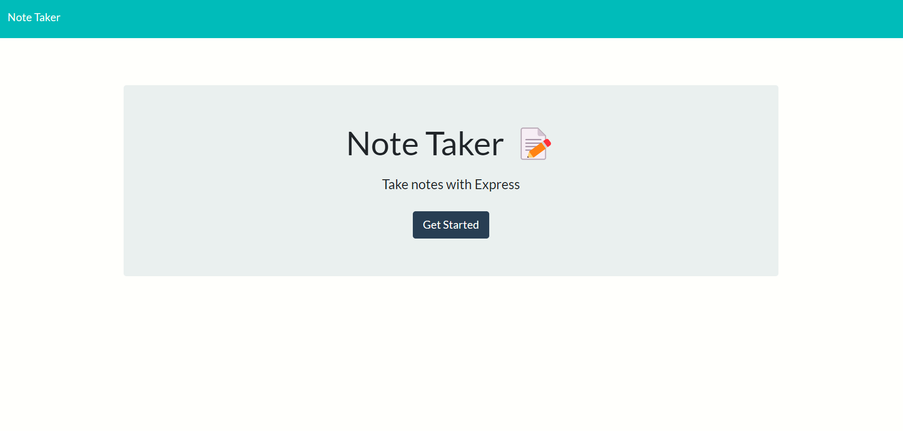
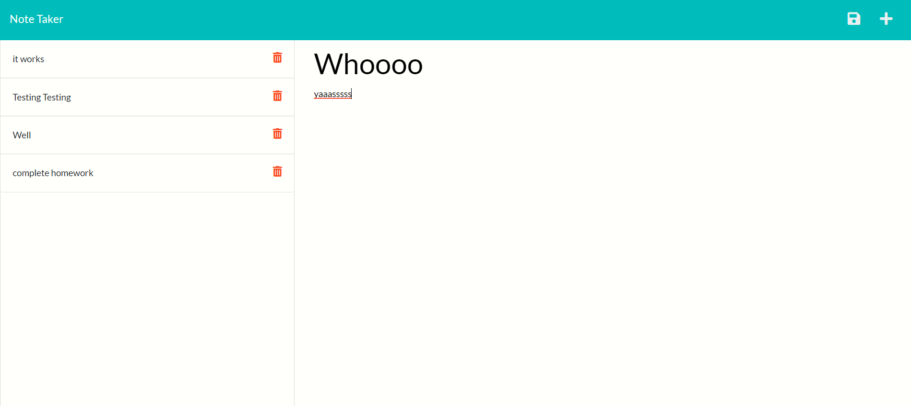
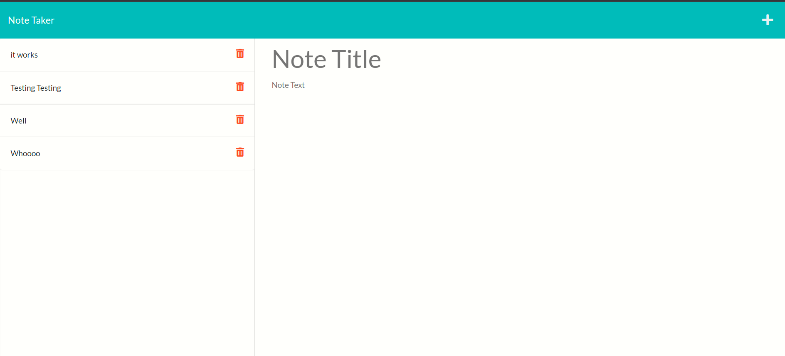
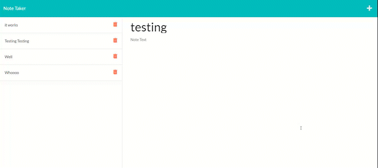

# NoteTaker

## Table of Contents
   1. [License](#license)
   2. [Project-Description](#description)
   3. [Installation-Guide](#installation-guide)
   4. [Project-Usage](#usage)
   5. [Project-Contributors](#contributors)
   6. [Project-Tests](#tests)
   7. [Links](#links)
   8. [Mock-Ups](#mock-ups)
   9. [Questions](#questions-contact-me-at)
--- 
## [License](./LICENSE)

---
## Description 
    This project is simple, it uses a few routes to read and write data so that it is persistant. It also allows for a note to be deleted. 
---
## Installation-Guide
    This app is deployed, a user need only to navigate too the repos which is linked below!
---
## Usage 
    When visiting a user can view the landing page, choose the get started button and start writing notes and saving them. If they have completed a task they can click the garbage can to remove it! 
---
## Contributors
    n/a
---
## Tests
    n/a
---
## Links
https://gentle-woodland-43088.herokuapp.com/
---
https://github.com/remotemana/note-taker
---
---
## Mock-Ups

### <ins>Image 1</ins>

---
### <ins>Image 2</ins>

---
### <ins>Image 3</ins>

---
### <ins>Gif</ins>

---
## Questions? Contact Me at...
lucas.e.roman@gmail.com | [github.com](https://github.com/remotemana)
